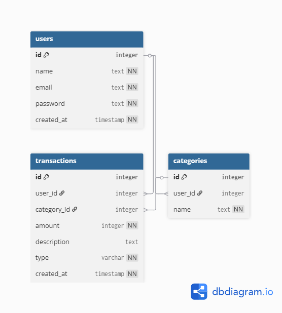

# 要件定義

## 機能要件

### 認証
- ユーザー登録・ログインができる
- JWTトークンで認証する
- 自分のデータのみ操作できる

### 収支管理
- 収支を登録・取得・更新・削除できる
- 収支にカテゴリを紐づけられる
- 一覧はページネーションで取得できる

### カテゴリ管理
- カテゴリを登録・取得・更新・削除できる

### 集計
- 月次・週次で収支の合計を取得できる

## 非機能要件
- パスワードはハッシュ化して保存する
- 認証にJWTを使用しステートレスな設計にする
- Dockerで環境を再現できる
- Alembicでスキーマ変更を管理する
- pytestでテストを書く

## エンドポイント一覧
POST    /users　　   ユーザー登録
GET     /users/{id}　ユーザー取得
PATCH   /users/{id}　ユーザー更新
DELETE  /users/{id}  ユーザー削除
POST    /auth/login  ログイン
GET     /users/me    ログイン中のユーザー取得

POST    /transactions          収支登録
GET     /transactions/summary  収支集計取得
GET     /transactions          収支一覧取得
PATCH　 /transactions/{id}     収支更新
DELETE  /transactions/{id}     収支削除

POST    /categories       カテゴリ登録
GET     /categories       カテゴリ一覧取得
PATCH   /categories/{id}  カテゴリ更新
DELETE  /categories/{id}   カテゴリ削除

## DB設計

### usersテーブル
id INTEGER PRIMARY KEY
name TEXT NOT NULL
email TEXT NOT NULL UNIQUE
password TEXT NOT NULL
created_at TIMESTAMP NOT NULL

### transactionsテーブル
id INTEGER PRIMARY KEY
user_id INTEGER FOREIGN KEY('users.id')
category_id INTEGER FOREIGN KEY('categories.id')
amount INTEGER NOT NULL
description TEXT NULLABLE
type VARCHAR(10) NOT NULL CHECK(type IN ('income', 'expense'))
created_at TIMESTAMP NOT NULL

### categoriesテーブル
id INTEGER PRIMARY KEY
user_id INTEGER FOREIGN KEY('users.id')
name TEXT NOT NULL

## アーキテクチャ

### 3層構造
- router   : リクエスト・レスポンスの処理
- service  : ビジネスロジック
- repository: DB操作

### ER図

### 技術選定理由
- **FastAPI** : 型安全・自動ドキュメント生成・高速。FastAPIは学習済みであること、軽量で速く、このアプリの規模だと適していることから。
- PostgreSQL : リレーション管理に適したRDB。PostgreSQLを使うのは実務で最も使われているRDBのため。
- JWT : ステートレス認証。JWTを採用するのはステートレスでサーバーがセッションを持たず拡張しやすい(サーバーがログイン情報を持たないためサーバーを増やしやすい)。  　      また、実務で広く使われているため。　　　　　　
- Docker : 環境の再現性を担保できるため

# ステートレスはサーバーがログイン状態を記憶しないタイプの認証,JWTはその中の一つ
